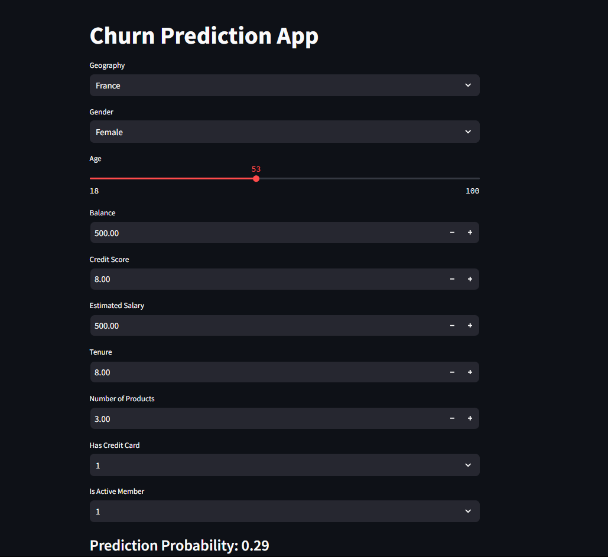

# Bank Customer Churn Prediction

## Overview
This project is a simple Artificial Neural Network (ANN) model designed to predict whether a bank customer is likely to churn (i.e., stop using the bank's services). The model is integrated into a user-friendly Streamlit web application, allowing users to input customer details and receive a churn prediction.

## Features
- **Interactive Web Interface:** Built using Streamlit for a smooth user experience.
- **Prediction Visualization:** Displays the churn probability and prediction result.
- **User Inputs:** Adjustable form fields for customer attributes such as credit score, geography, balance, and more.

## Demo


## Installation
1. Clone the repository:
   ```bash
   git clone <repository_url>
   ```
2. Install required packages:
   ```bash
   pip install -r requirements.txt
   ```

## Usage
1. Run the Streamlit app:
   ```bash
   streamlit run app.py
   ```
2. Open the provided local URL in your web browser to access the app.
    https://churnpredictionann-5ucbzkf8gganeqw5bvv8ir.streamlit.app/

## Input Parameters
- **Geography:** Dropdown to select the customer's country.
- **Gender:** Dropdown to select gender.
- **Age:** Slider to choose the customer's age.
- **Balance:** Numerical input for the customer's bank balance.
- **Credit Score:** Numerical input for the customer's credit score.
- **Estimated Salary:** Numerical input for the customer's estimated annual salary.
- **Tenure:** Numerical input for the number of years the customer has been with the bank.
- **Number of Products:** Numerical input for the number of bank products used by the customer.
- **Has Credit Card:** Boolean to indicate if the customer has a credit card.
- **Is Active Member:** Boolean to indicate if the customer is an active member.

## Prediction
The model outputs a churn probability along with a prediction:
- **Probability:** Displays the likelihood that the customer will churn.
- **Prediction Result:** Displays whether the customer is likely to churn or stay.

## Model
- **Architecture:** A simple ANN built using TensorFlow or Keras.
- **Training Data:** The model was trained on a publicly available bank customer dataset.

## Technologies Used
- **Frontend:** Streamlit
- **Backend:** Python, TensorFlow/Keras for machine learning
- **Data Processing:** Pandas, NumPy, Scikit-learn

## Example Output
```
Prediction Probability: 0.29
Customer will likely stay
```

## Future Improvements
- Enhance the user interface.
- Implement feature importance visualization.
- Include additional ML models for comparison.
- Add secure model deployment features.

## License
This project is licensed under the MIT License.

## Contributing
Contributions are welcome! Feel free to open issues or submit pull requests.

